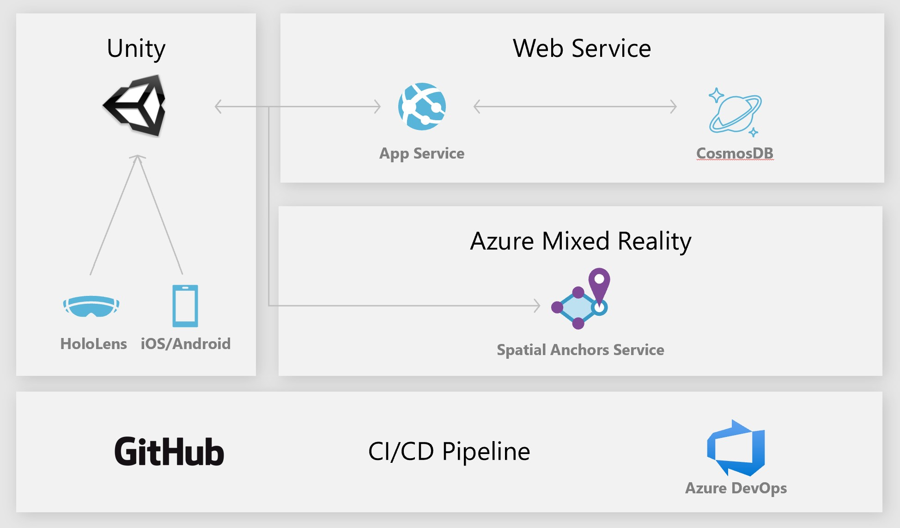

# Azure Spatial Anchors Navigation Demo

Welcome to the ASA Navigation repository on GitHub. Here you can find an indoor navigation that was build using the ASA service. The app is capable of guiding a user on a predefined path (an animated dog is the "guide") and includes multi-platform support (iOS/Android/HoloLens).

Azure Spatial Anchors is a managed cloud service and platform that enables multi-user, spatially aware mixed reality and augmented reality (MR/AR) apps for HoloLens, iOS devices with ARKit, and Android devices with ARCore. For more information, see [Azure Spatial Anchors documentation](https://docs.microsoft.com/azure/spatial-anchors/overview "Azure Spatial Anchors Documentation")



# How to use the demo
## AR Navigation Demo
The workflow for the navigation demo is simple. There is a "Creator Mode" and a "Visitor Mode".
On app launch the app checks whether you have already created anchors in a previous session or not (by contacting the webservice & CosmosDB). If no anchor is found, the creator mode is launched. If an anchor is found, the visitor mode is launched and all anchors are retrieved from the server. 
- Creator Mode: Place anchors for the guide to follow. The guide will use the same sequence in which the anchors were created. 
	- Important: Please make sure your anchors are not too far apart (especially on older devices). Otherwise the app will get stuck in the "saving" step (no connection can be made between two anchors). To fix this you have to delete all anchors (via the REST API) and start over :(
- Visitor Mode: The app will download all anchors on app launch. Please click next to initiate anchor search in your environment.
## Conference Room Demo
- Open the AR-Navigation scene and set the guide object to null (in the AzureSpatialAnchors object)
- Set the prefabs 1-8 to "Conference room busy.prefab" or "Conference room available.prefab"
- The app will have the same workflow as in the navigation demo above (creator/visitor mode)
- The prefab in visitor mode is set by the prefab ID which is downloaded at app start from the CosmosDB. To modify the prefab type at a specific position (e.g. change conference room monitor from free to busy) edit the number in the AnchorType column with the CosmosDB Data Explorer on portal.azure.com)

## Delete or modify anchors
- Anchors can be delete via the REST API of your webservice:
	- Go to https://your-webserivce.azurewebsites.net/index.html in your browser
	- Click "/api/anchors/delete" and then execute
- You can set the prefab type remotely via the CosmosDB
	- Open the AR-Navigation scene and assign prefabs (1-8) (in the AzureSpatialAnchors object) 
	- After creating your objects you can modify the prefab type via the CosmosDB Data Explorer on portal.azure.com

# First time setup
This tutorial is a modified version of the original documentation found [here](https://docs.microsoft.com/en-us/azure/spatial-anchors/tutorials/tutorial-share-anchors-across-devices?tabs=VS%2CUnity).

## Prerequisites

To complete this tutorial, make sure you have:
- Download and install GitHub Desktop
- Download install UnityHub and create a unity account
- Download and install the latest version of Unity in Unity Hub. **Important:**
- Make sure Visual Studio is selected in the installer **and**
- Depending on your platform, select Universal Windows Platform, iOS or Android Build Support (make sure to open the dropdown menu and select Android SDK as well)

  
## Download this repository
Clone this repository with GitHub Desktop or git clone (console).

## Create a Spatial Anchors resource

Go to the  [Azure portal](https://portal.azure.com/).

In the left navigation pane in the Azure portal, select  **Create a resource**.

Use the search box to search for  **Spatial Anchors**.


Select  **Spatial Anchors**. In the dialog box, select  **Create**.

In the  **Spatial Anchors Account**  dialog box:

-   Enter a unique resource name, using regular alphanumeric characters.
    
-   Select the subscription that you want to attach the resource to.
    
-   Create a resource group by selecting  **Create new**. Name it  **myResourceGroup**  and select  **OK**. A  [resource group](https://docs.microsoft.com/en-us/azure/azure-resource-manager/management/overview#terminology)  is a logical container into which Azure resources like web apps, databases, and storage accounts are deployed and managed. For example, you can choose to delete the entire resource group in one simple step later.
    
-   Select a location (region) in which to place the resource.
    
-   Select  **New**  to begin creating the resource.
    
    
    

After the resource is created, Azure Portal will show that your deployment is complete. Click  **Go to resource**.


Then, you can view the resource properties. Copy the resource's  **Account ID**  value into a text editor because you'll need it later.


Under  **Settings**, select  **Key**. Copy the  **Primary key**  value into a text editor. This value is the  `Account Key`. You'll need it later.


## Create and publish app backend
Please create the app backend as described [here](Webservice/readme.md)


## Deploy the sample app
In UnityHub (Projects-> Add), open the the  `Unity`  folder. If the 'Unity Version' column is empty, select your current unity version. Unity might prompt you about a different Unity version between the project and the one you've installed on your machine. This warning is okay, as long as your version of Unity Editor is newer than the one the project was created with. In that case, just click  **Continue**. If your Unity Editor version is older than the one the project needs, click  **Quit**, and upgrade your Unity Editor.


Open  **Build Settings**  by selecting  **File**  >  **Build Settings**.

In the  **Platform**  section, select  **Android/iOS/Universal Windows Platform**. Select  **Switch Platform**  to change the platform. Unity might prompt you to install Android/iOS/UWP support components if they're missing.


Close the  **Build Settings**  window.

## Configure the account identifier and key

In the  **Project**  pane, navigate to  `Assets/AzureSpatialAnchors.Examples/Scenes`  and open the  `AR-Navigation.unity`  scene file.

The next step is to configure the app to use your account identifier and account key. You copied them into a text editor when  setting up the Spatial Anchors resource.

In the  **Project**  pane, navigate to  `Assets\AzureSpatialAnchors.SDK\Resources`. Select  `SpatialAnchorConfig`. Then, in the  **Inspector**  pane, enter the  `Account Key`  as the value for  `Spatial Anchors Account Key`  and the  `Account ID`  as the value for  `Spatial Anchors Account Id`.

In the  **Project**  pane, navigate to  `Assets\AzureSpatialAnchors.Examples\Resources`. Select  `SpatialAnchorSamplesConfig`. Then, in the  **Inspector**  pane, enter the  `Sharing Anchors Service url`  (from your ASP.NET web app Azure deployment) as the value for  `Base Sharing Url`, replacing  `index.html`  with  `api/anchors`. It should look like this:  `https://<app_name>.azurewebsites.net/api/anchors`.

Save the scene by selecting  **File**  >  **Save**.

## Deploy to your device

### Deploy to Android device

Sign in on your Android device and connect it to your computer by using a USB cable.

Open  **Build Settings**  by selecting  **File**  >  **Build Settings**.

Under  **Scenes In Build**, ensure all the scenes have a check mark next to them.

Make sure  **Export Project**  doesn't have a check mark. Select  **Build And Run**. You'll be prompted to save your  `.apk`  file. You can pick any name for it.

### Deploy to HoloLens

Open  **Build Settings**  by selecting  **File**  >  **Build Settings**.

Under  **Scenes In Build**, ensure all the scenes have a check mark next to them.

Select  **Build**. In the dialog box, select a folder in which to export the HoloLens Visual Studio project.

When the export is complete, a folder containing the exported HoloLens project will appear.

In the folder, double-click  **AR-Navigation.sln**  to open the project in Visual Studio.

Change the  **Solution Configuration**  to  **Release**, change the  **Solution Platform**  to  **x86 (HoloLens 1)**, and select  **Device**  from the deployment target options.

If using HoloLens 2, use  **ARM64**  as the  **Solution Platform**, instead of  **x86**.


Turn on the HoloLens device, sign in, and connect the device to the PC by using a USB cable.

Select  **Debug**  >  **Start debugging**  to deploy your app and start debugging.

Follow the instructions in the app to place and recall an anchor.

In Visual Studio, stop the app by selecting either  **Stop Debugging**  or Shift+F5.


### Deploy to an iOS device

Open  **Build Settings**  by selecting  **File**  >  **Build Settings**.

Under  **Scenes In Build**, ensure all the scenes have a check mark next to them.

Select  **Build**. In the dialog box that opens, select a folder to export the Xcode project to.

When the export is complete, a folder that contains the exported Xcode project will appear.

Note: 
If a window asking you if you want to replace or append appears, we recommend that you select  **Append**  because it's faster. You should only need to select  **Replace**  if you're changing assets in your scene. (For example, if you're adding, removing, or changing parent/child relationships, or if you're adding, removing, or changing properties.) If you're only making source code changes,  **Append**  should be enough.

#### Convert the Xcode project to xcworkspace containing Azure Spatial Anchors references
In the exported Xcode project folder, run this command in the Terminal to install the necessary CocoaPods for the project:

bashCopy

```
pod install --repo-update

```

Now you can open  `Unity-iPhone.xcworkspace`  to open the project in Xcode:

bashCopy

```
open ./Unity-iPhone.xcworkspace

```

Note

See the troubleshooting steps  [here](https://docs.microsoft.com/en-us/azure/spatial-anchors/quickstarts/get-started-unity-ios#cocoapods-issues-on-macos-catalina-1015)  if you're having CocoaPod issues after upgrading to macOS Catalina (10.15).

Select the root  **Unity-iPhone**  node to view the project settings, and then select the  **General**  tab.

Under  **Signing**, make sure  **Automatically manage signing**  is enabled. If it's not, enable it, and then select  **Enable Automatic**  in the dialog box that appears to reset the build settings.

Under  **Deployment Info**, make sure the  **Deployment Target**  is set to  `11.0`.

#### Deploy the app to your iOS device
Connect the iOS device to the Mac and set the  **active scheme**  to your iOS device.


Select  **Build and then run the current scheme**.


Note

If you see a  `library not found for -lPods-Unity-iPhone`  error, you probably opened the  `.xcodeproj`  file instead of the  `.xcworkspace`  file.

start a new session, and then locate it.

In Xcode, stop the app by selecting  **Stop**.

# More information about the Azure Spatial Anchors Service 

[Create and locate anchors](https://docs.microsoft.com/azure/spatial-anchors/concepts/create-locate-anchors-unity "Create/locate anchors")

[MR/AR sharing across devices and sessions](https://docs.microsoft.com/azure/spatial-anchors/tutorials/tutorial-use-cosmos-db-to-store-anchors "Sharing across sessions")

[Anchor Relationships](https://docs.microsoft.com/azure/spatial-anchors/concepts/anchor-relationships-way-finding "Anchor Relationships")

[Experience Guidelines](https://docs.microsoft.com/en-us/azure/spatial-anchors/concepts/guidelines-effective-anchor-experiences "Experience Guidelines")

[Frequently Asked Questions (FAQ)](https://docs.microsoft.com/azure/spatial-anchors/spatial-anchor-faq "FAQ")

## CC Attributions
Many thanks to Shiba Inu. for his Dog model!
