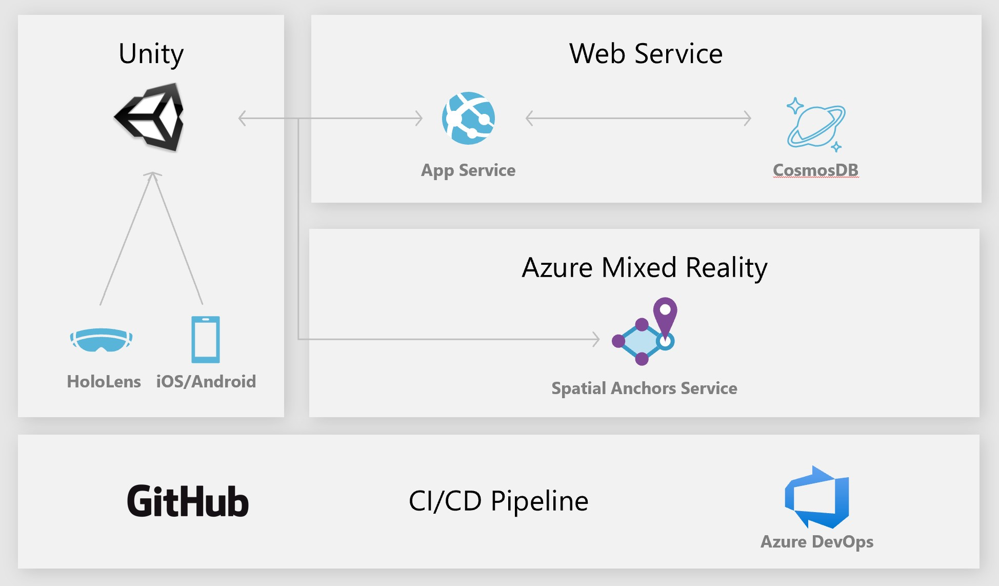

# Azure Spatial Anchors Navigation Demo

Welcome to the ASA Navigation repository on GitHub. Here you can find an indoor navigation that was build using the ASA service. The app is capable of guiding a user on a predefined path (an animated dog is the "guide") and includes multi-platform support (iOS/Android/HoloLens).

Azure Spatial Anchors is a managed cloud service and platform that enables multi-user, spatially aware mixed reality and augmented reality (MR/AR) apps for HoloLens, iOS devices with ARKit, and Android devices with ARCore. For more information, see [Azure Spatial Anchors documentation](https://docs.microsoft.com/azure/spatial-anchors/overview "Azure Spatial Anchors Documentation")

## Get Started
(Please use the official documentation for more detailled instructions)

1. Clone the repository from GitHub
2. Open the "Sharing" folder and create/publish your own webapp to Azure
3. Get the latest version of Unity (incl. all relevant SDKs, e.g. Android/iOS/UWP) and open the local repository
4. Update references to the webapp, the ASA service and CosmosDB as outlined [in the documentation](https://docs.microsoft.com/azure/spatial-anchors/tutorials/tutorial-use-cosmos-db-to-store-anchors "Azure Spatial Anchors Documentation").
5. Build and deploy the app
6. Create and persist anchors by placing them in the world, then restart the app to get into visitor mode
7. The app will automatically detect whether anchors have already been created and launch the correct mode, to replace existing anchors, please delete all anchors via the REST api of the webapp.

## More information about the Azure Spatial Anchors Service 

[Create and locate anchors](https://docs.microsoft.com/azure/spatial-anchors/concepts/create-locate-anchors-unity "Create/locate anchors")

[MR/AR sharing across devices and sessions](https://docs.microsoft.com/azure/spatial-anchors/tutorials/tutorial-use-cosmos-db-to-store-anchors "Sharing across sessions")

[Anchor Relationships](https://docs.microsoft.com/azure/spatial-anchors/concepts/anchor-relationships-way-finding "Anchor Relationships")

[Experience Guidelines](https://docs.microsoft.com/en-us/azure/spatial-anchors/concepts/guidelines-effective-anchor-experiences "Experience Guidelines")

[Frequently Asked Questions (FAQ)](https://docs.microsoft.com/azure/spatial-anchors/spatial-anchor-faq "FAQ")