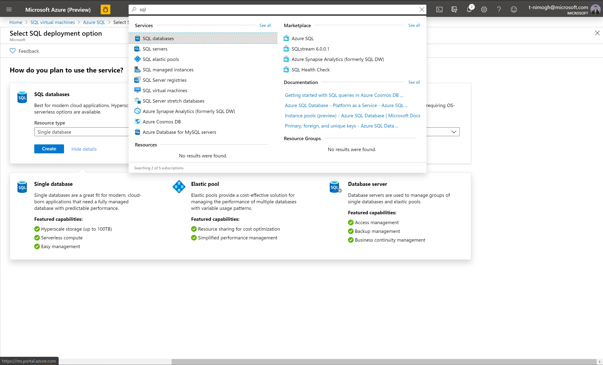
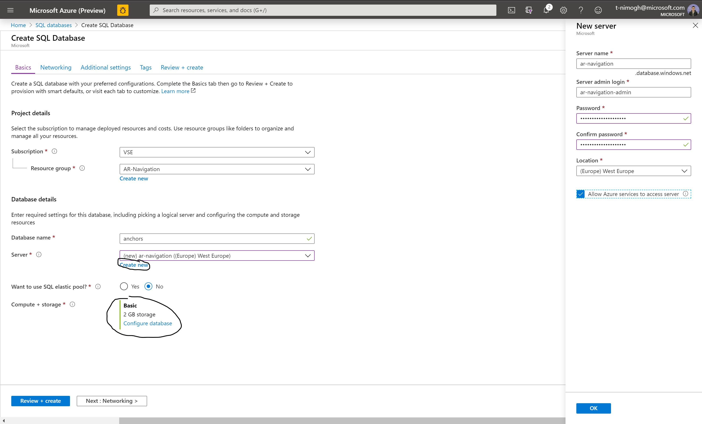
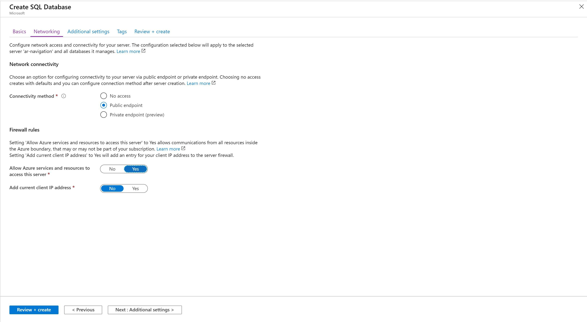
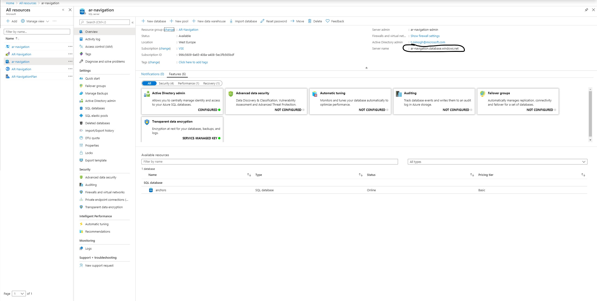

## Create an SQL Database

1.  In a new browser window, sign in to the  [Azure portal](https://portal.azure.com/).
    
2.  In the left navigation pane, select  **Create a resource**. Select  **Databases**  and then select  **SQL Databases**.
    
    
    
3.  On the  **Create SQL Database**  page, enter the settings for the new Azure SQL Database:

	Subscription: Your subscription
	
Resource Group: Use the same RG

Database Name: Enter a unique name, **Remember this for later**

Server: Create New, Basic server (4$/month) is sufficient

**Important:** Please remember your sql username and password for later. 

    
4.  Click on next
    Now you have to configure networking. It is **essential** you set all options to those in the screenshot below:
    
    
    
5.  It takes a few minutes to create the account. You'll see a message that states  **Your deployment is underway**. Wait for the deployment to finish and then select  **Go to resource**.
    
    **Please note the servername listed here:**
    

## Make minor changes to the SharingService files
In  **Solution Explorer**, open  `SQL-Backend\appsettings.json`.

Replace the values for:
"SQL-ServerAdress": "your-database.windows.net",

"SQL-Database-Name": "database_name",

"SQL-Username": "username",

"SQL-Password": "password"

## Deploy your Sharing Anchors Service
Open Visual Studio, and open the project at the  `SQL-Backend\webservice.sln`.

### Open the publish wizard

In  **Solution Explorer**, right-click the  **Webservice**  project and select  **Publish**.

The Publish Wizard starts. Select  **App Service**  >  **Publish**  to open the  **Create App Service**  dialog box.

### Sign in to Azure

In the  **Create App Service**  dialog box, select  **Add an account**  and sign in to your Azure subscription. If you're already signed in, select the account you want from the drop-down list.

Note: If you're already signed in, don't select  **Create**  yet.

### Use existing resource group

### Create an App Service plan

An  [App Service plan](https://docs.microsoft.com/en-us/azure/app-service/overview-hosting-plans)  specifies the location, size, and features of the web server farm that hosts your app. You can save money when hosting multiple apps by configuring the web apps to share a single App Service plan.

App Service plans define:

-   Region (for example: North Europe, East US, or Southeast Asia)
-   Instance size (small, medium, or large)
-   Scale count (1 to 20 instances)
-   SKU (Free, Shared, Basic, Standard, or Premium)

Next to  **Hosting Plan**, select  **New**.

In the  **Configure Hosting Plan**  dialog box, use these settings:

App Service Plan: "MySharingServicePlan", 
Location: "West US",
Size: "Free" (cheapest option, will slow down appstart significantly)

Select  **OK**.

### Create and publish the web app

In  **App Name**, enter a unique app name (valid characters are  `a-z`,  `0-9`, and  `-`), or accept the automatically generated unique name. The URL of the web app is  `https://<app_name>.azurewebsites.net`, where  `<app_name>`  is your app name.

Select  **Create**  to start creating the Azure resources.

After the wizard finishes, it publishes the ASP.NET Core web app to Azure and then opens the app in your default browser.

The app name you used in this section is used as the URL prefix in the format  `https://<app_name>.azurewebsites.net`. Take note of this URL because you'll need it.
